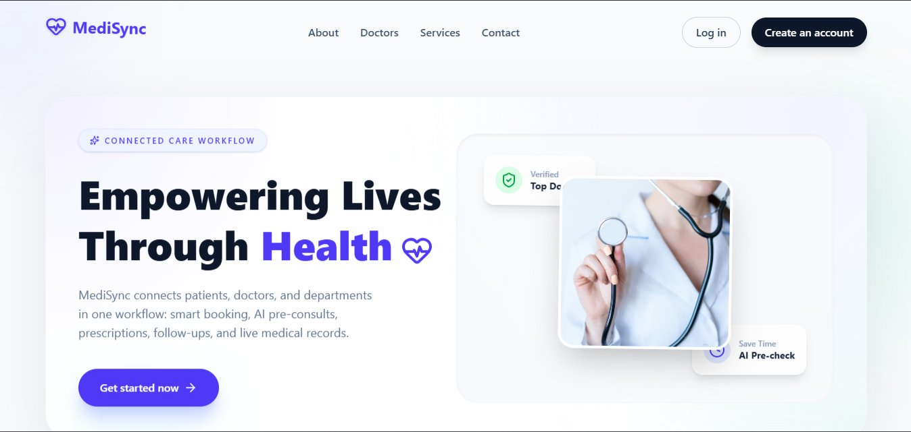
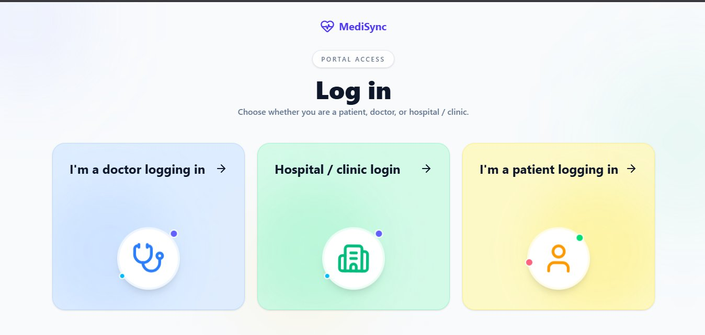
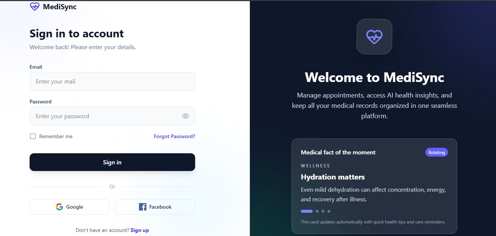
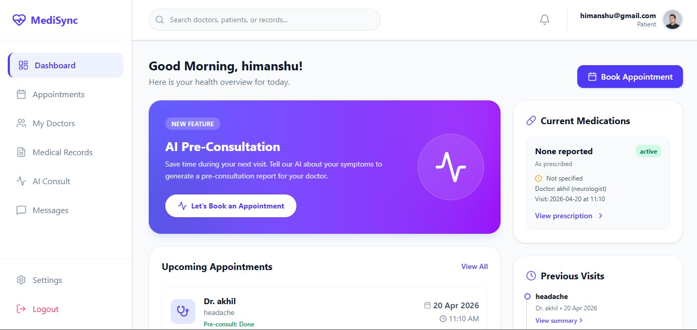
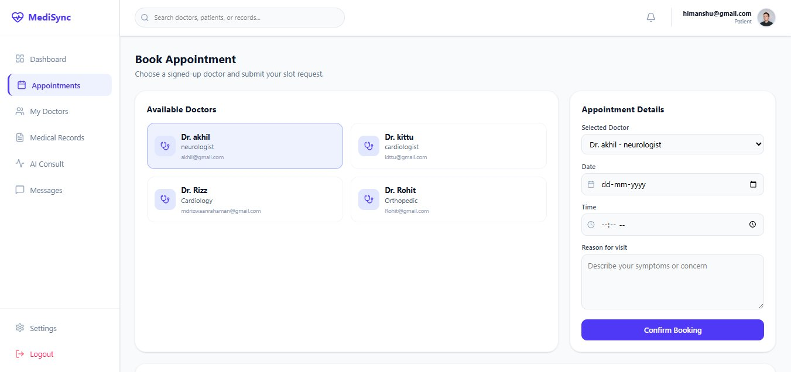
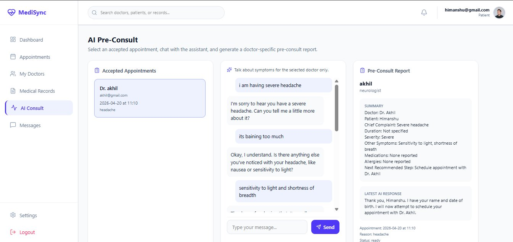
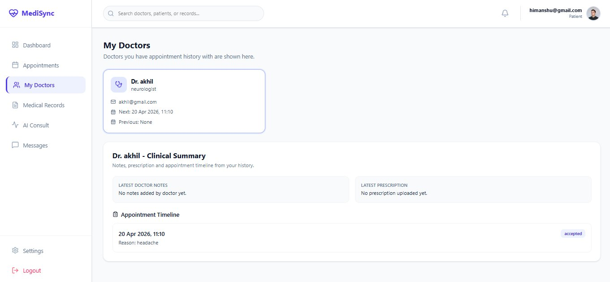
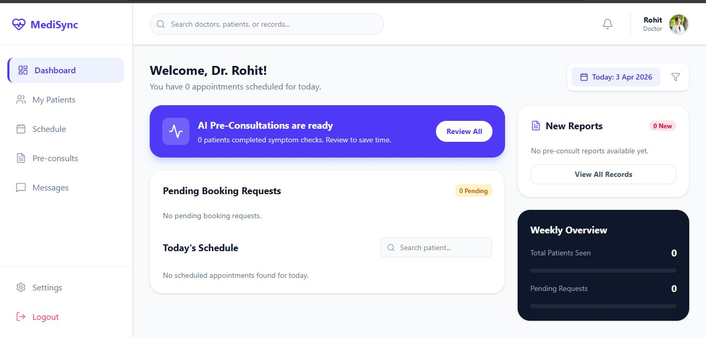

# MediSync
 
> Doctors spend a significant amount of time during consultation just collecting basic symptom history and the basic questions about patient. MediSync handles that before the patient even arrives — so the entire consultation is spent on actual diagnosis and both doctors and patients
 
**🔗 Live Demo → [medi-sync-virid.vercel.app](https://medi-sync-virid.vercel.app)**
 
Built for **CodeCure AI Hackathon · SPIRIT 2026 · IIT (BHU) Varanasi**
 
---
 
## Screenshots
 
**Landing page**

 
**Role-based login — patient, doctor, or hospital**

 
**Sign in — with rotating medical health tips**

 
**Patient dashboard — upcoming appointments, medications, AI pre-consult prompt**

 
**Book appointment — browse doctors, pick slot, confirm**

 
**AI pre-consult — three-panel: appointment selector, live chat, generated report**

 
**My Doctors — clinical summary, doctor notes, appointment timeline**

 
**Doctor dashboard — AI pre-consult alerts, schedule, weekly overview**

 
---
 
## The Problem
 
India has one of the highest patient-to-doctor ratios in the world. When a patient finally gets their appointment, the doctor receives them cold — no prior symptom context, no medication history, no record of how things have progressed. Critical information is either scattered across systems, written on paper, or never captured at all.
 
The result: doctors spend most of their limited consultation time gathering basic information instead of providing actual care.
 
## The Solution
 
MediSync inserts an AI layer between booking and the consultation itself.
 
Before the appointment, a Gemini-powered assistant walks the patient through a structured symptom conversation — onset, severity, duration, associated symptoms, medications — and produces a clinical summary ready for the doctor to read the moment they open the patient's file.
 
No rushed history-taking. No missed details. Better care in the same amount of time.
 
---
 
## What's Built
 
### For patients
- Register and log in securely
- Browse available doctors and book appointments
- Complete an AI-guided pre-consult conversation before the visit
- Upload medical reports and files via Cloudinary
- View appointment history and linked doctors
 
### For doctors
- Dedicated login and dashboard
- Read AI-generated pre-consult summaries before each appointment
- Access patient-uploaded reports and files
- Manage schedule and appointment slots
- View full patient history and previous pre-consults
 
### For departments
- Upload department-level reports
- Access AI-generated analytics summaries across all department reports
 
---
 
## AI Pre-Consult — How It Works
 
The core of MediSync is the Gemini-powered pre-consult conversation. When a patient has an upcoming appointment, they chat with the AI assistant, which:
 
1. Collects chief complaint, symptom timeline, severity, and associated factors
2. Asks about current medications and allergies
3. Probes for red flags (chest pain, breathing difficulty, neurological symptoms)
4. Maintains full conversation memory throughout the session
5. Generates a structured clinical summary when sufficient information is gathered
 
The doctor opens the patient's file and sees the summary immediately — contextualised, organised, and ready to act on.
 
---
 
## Tech Stack
 
| Layer | Technology |
|---|---|
| Frontend (web) | React 19 · TypeScript · Vite 7 · Tailwind CSS 4 · React Router · Lucide |
| Mobile (Flutter) | Flutter · Dart |
| Backend | FastAPI · Python |
| AI | Google Gemini API |
| Database | MongoDB Atlas |
| File Storage | Cloudinary |
| Auth | JWT |
| CI/CD | GitHub Actions · Vercel |
 
---
 
## Mobile App (Flutter)
 
MediSync has a companion Flutter app built for Android and iOS. It uses a single codebase with role-based routing — patients and doctors log in to separate dashboards from the same app.
 
The mobile app is currently in active development. The authentication and dashboard shell are in place; full feature parity with the web app (pre-consult, reports, appointments) is planned for the next phase, connecting to the same FastAPI backend.
 
**Why Flutter:** A single Dart codebase targets both Android and iOS, keeping mobile development lean for a small team. Sharing the backend with the web app means no duplicate API logic — any improvement to the backend immediately benefits both platforms.
 
---
 
```
Patient / Doctor / Department
          │
    React Frontend
    (Vercel — auto-deploy via GitHub Actions)
          │  HTTP / REST
    FastAPI Backend
      ├── MongoDB Atlas   — users, appointments, conversations, summaries, report metadata
      ├── Gemini API      — pre-consult conversation + clinical summary generation
      └── Cloudinary      — medical file storage and retrieval
```
 
---
 
## API Endpoints
 
**Authentication**
| Method | Endpoint |
|---|---|
| POST | `/register` |
| POST | `/login` |
| POST | `/register/doctor` |
| POST | `/login/doctor` |
 
**Doctor Discovery & Appointments**
| Method | Endpoint |
|---|---|
| GET | `/doctors` |
| POST | `/appointments/book` |
| POST | `/doctor/appointments/schedule` |
| GET | `/appointments/{doctor_email}` |
| GET | `/patient/appointments/{patient_email}` |
 
**AI & Clinical Context**
| Method | Endpoint | Description |
|---|---|---|
| POST | `/ai-chat` | Gemini pre-consult conversation with memory |
| GET | `/patient/preconsults/{patient_email}` | Patient's pre-consult history |
| GET | `/doctor/preconsults/{doctor_email}` | All summaries for a doctor's patients |
 
**Reports & Files**
| Method | Endpoint |
|---|---|
| POST | `/report/upload` |
| GET | `/patient/reports/{patient_email}` |
| POST | `/department/reports/upload` |
| GET | `/department/reports/{department_id}` |
| GET | `/department/reports/{department_id}/summary` |
 
**Care Network**
| Method | Endpoint |
|---|---|
| GET | `/patient/doctors/{patient_email}` |
| GET | `/doctor/patients/{doctor_email}` |
| GET | `/doctor/patient-files/{doctor_email}` |
 
---
 
## Setup
 
**Prerequisites:** Node.js 18+, Python 3.10+, MongoDB Atlas database, Gemini API key, Cloudinary account
 
```bash
# 1. Clone
git clone https://github.com/HimanshuIITP/MediSync
cd MediSync
 
# 2. Backend
cd backend
pip install -r requirements.txt
cp .env.example .env        # add GEMINI_API_KEY, MONGO_URI, CLOUDINARY_* credentials
uvicorn main:app --reload --host 0.0.0.0 --port 8000
 
# 3. Frontend
cd ../frontend
npm install
echo "VITE_API_BASE_URL=http://127.0.0.1:8000" > .env
npm run dev
```
 
- Frontend: http://localhost:5173
- Backend API docs: http://localhost:8000/docs
 
---
 
## Patient Flow
 
```
Register → Browse doctors → Book appointment
       → AI pre-consult conversation
       → Upload reports
       → Attend consultation (doctor already briefed)
```
 
## Doctor Flow
 
```
Login → View appointments → Read AI pre-consult summary
     → Open patient reports → Conduct informed consultation
```
 
---
 
## Scalability
 
- Stateless REST APIs — containerise and deploy anywhere
- MongoDB Atlas — horizontal scaling out of the box
- Cloudinary — CDN-backed file storage, no infrastructure to manage
- Environment-driven configuration — staging and production with no code changes
- Role-segregated modules — can split into microservices as load grows
 
---
 
## Repository Structure
 
```
backend/         FastAPI app — routes, database integration, AI utilities
frontend/        React web app — patient, doctor, and department experiences
Flutter/         Flutter mobile app — role-based login, patient and doctor dashboards
.github/         GitHub Actions workflow for frontend deployment
API_INTEGRATION.md        Endpoint and request reference
VERIFICATION_CHECKLIST.md End-to-end validation guide
```
 
---

## Team
 
Himanshu Kundal - Backend, little fronend and integration

Debarghya Ray - Backend and Flutter app

Anirup Roy - Frontend

Md Rizwaan Rahaman - Frontend

Team project with collaborative development across frontend, backend, and integration.
IIT (BHU) Varanasi · SPIRIT 2026 · CodeCure AI Hackathon
